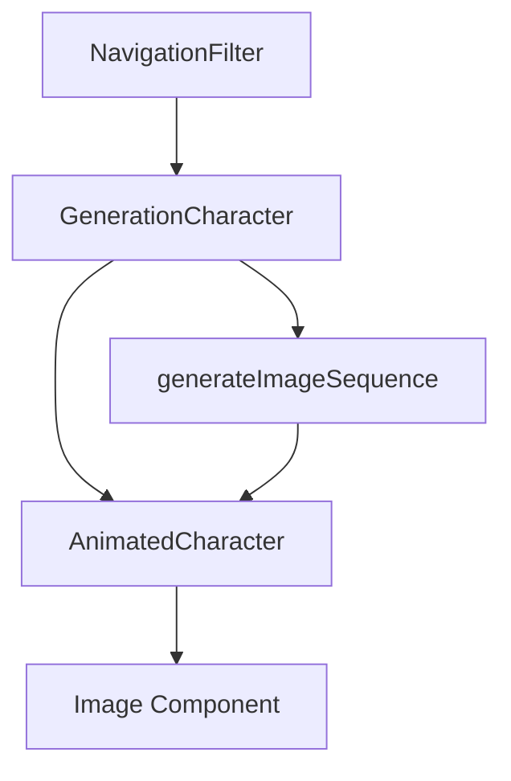

This is a [Next.js](https://nextjs.org) project bootstrapped with [`create-next-app`](https://nextjs.org/docs/app/api-reference/cli/create-next-app).

## Getting Started

First, run the development server:

```bash
npm run dev
# or
yarn dev
# or
pnpm dev
# or
bun dev
```
# Animated Characters System

## Overview
The Animated Characters system provides smooth, performant sprite-based animations for character representations throughout the application. It uses a sequence of PNG images to create flipbook-style animations triggered by user interaction.

## Architecture

### Components Structure
```
src/
├── components/
│   ├── AnimatedCharacter/           # Core animation engine
│   │   ├── AnimatedCharacter.tsx    # Main component
│   │   ├── AnimatedCharacter.types.ts
│   │   ├── AnimatedCharacter.module.css
│   │   └── hooks/
│   │       └── useImagePreloader.ts # Image preloading logic
│   └── GenerationCharacter/         # Generation-specific wrapper
│       └── GenerationCharacter.tsx  # Wrapper for generation avatars
└── utils/
    └── imageSequence.ts             # Image sequence generator utility
```

### Image Assets Structure
```
public/
└── characters/
    ├── test/          # Test animations
    │   ├── 86400.png
    │   ├── 86401.png
    │   └── ...
    ├── silent/        # Silent Generation
    │   ├── frame_001.png
    │   ├── frame_002.png
    │   └── ...
    ├── boomer/        # Baby Boomers
    │   └── frame_XXX.png
    ├── genx/          # Generation X
    │   └── frame_XXX.png
    ├── millennial/    # Millennials
    │   └── frame_XXX.png
    ├── genz/          # Generation Z
    │   └── frame_XXX.png
    └── alpha/         # Generation Alpha
        └── frame_XXX.png
```

## Component Hierarchy



## Usage Guide

### 1. Basic AnimatedCharacter Usage

The core `AnimatedCharacter` component requires an array of image paths:

```typescript
import { AnimatedCharacter } from '@/components/AnimatedCharacter';

// Direct usage with image array
<AnimatedCharacter
  images={[
    '/characters/test/001.png',
    '/characters/test/002.png',
    '/characters/test/003.png'
  ]}
  alt="Test Animation"
  width={200}
  height={200}
  frameRate={24}
  loop={true}
  playOnHover={true}
/>
```

### 2. Using the Image Sequence Generator

For numbered sequences, use the `generateImageSequence` utility:

```typescript
import { generateImageSequence } from '@/utils/imageSequence';

const images = generateImageSequence({
  basePath: '/characters/test',
  prefix: 'frame_',      // e.g., "frame_001.png"
  startFrame: 1,
  endFrame: 30,
  digits: 3,             // Padding: 001, 002, 003
  extension: 'png'
});

<AnimatedCharacter images={images} ... />
```

### 3. Generation Character Wrapper

For generation-specific avatars, use the simplified wrapper:

```typescript
import { GenerationCharacter } from '@/components/GenerationCharacter';

<GenerationCharacter
  characterFolder="genz"
  frameStart={1}
  frameEnd={30}
  framePrefix="frame_"
  size={80}
  frameRate={12}
  showBorder={true}
  borderColor="border-orange-500"
/>
```

### 4. Circular Avatar Style

To create circular avatars with borders:

```typescript
// Using GenerationCharacter (includes circular styling)
<GenerationCharacter
  characterFolder="millennial"
  frameStart={1}
  frameEnd={20}
  size={100}
  showBorder={true}
  borderColor="border-blue-500"
/>

// Or with AnimatedCharacter directly
<div className="w-24 h-24 rounded-full overflow-hidden border-2 border-orange-500">
  <AnimatedCharacter
    images={images}
    width={96}
    height={96}
    frameRate={24}
    loop={true}
    playOnHover={true}
  />
</div>
```

## Configuration Options

### AnimatedCharacter Props

| Prop | Type | Default | Description |
|------|------|---------|-------------|
| `images` | `string[]` | required | Array of image paths |
| `alt` | `string` | required | Alt text for accessibility |
| `width` | `number \| string` | `100` | Component width |
| `height` | `number \| string` | `100` | Component height |
| `frameRate` | `number` | `24` | Frames per second |
| `loop` | `boolean` | `true` | Loop animation |
| `playOnHover` | `boolean` | `true` | Play on hover (false = click to play) |
| `reverseOnLeave` | `boolean` | `true` | Return to frame 0 on mouse leave |
| `className` | `string` | `''` | Additional CSS classes |
| `showSkeleton` | `boolean` | `true` | Show loading skeleton |

### GenerationCharacter Props

| Prop | Type | Default | Description |
|------|------|---------|-------------|
| `characterFolder` | `string` | required | Folder name in `/public/characters/` |
| `frameStart` | `number` | required | First frame number |
| `frameEnd` | `number` | required | Last frame number |
| `framePrefix` | `string` | `''` | Filename prefix before number |
| `size` | `number` | `80` | Width and height (circular) |
| `frameRate` | `number` | `12` | Animation speed |
| `showBorder` | `boolean` | `true` | Show circular border |
| `borderColor` | `string` | `'border-slate-300'` | Tailwind border color class |

## File Naming Conventions

### Pattern 1: Simple Numbering
```
1.png, 2.png, 3.png, ... 120.png
```
Configuration:
```typescript
{
  prefix: '',
  digits: 0,  // No padding
}
```

### Pattern 2: Padded Numbers
```
001.png, 002.png, 003.png, ... 120.png
```
Configuration:
```typescript
{
  prefix: '',
  digits: 3,  // 3-digit padding
}
```

### Pattern 3: Prefix + Padded
```
frame_001.png, frame_002.png, ... frame_120.png
```
Configuration:
```typescript
{
  prefix: 'frame_',
  digits: 3,
}
```

### Pattern 4: Complex Naming
```
character_walk_00001.png, character_walk_00002.png
```
Configuration:
```typescript
{
  prefix: 'character_walk_',
  digits: 5,
}
```

## Performance Considerations

### Image Optimization
- Keep frame dimensions consistent across the sequence
- Use PNG for transparency, JPG for better compression (no transparency)
- Recommended max dimensions: 500x500px per frame
- Optimize images before adding (tools: TinyPNG, ImageOptim)

### Frame Count Guidelines
- **Icon/Avatar**: 10-20 frames
- **Button Animation**: 5-15 frames
- **Hero Animation**: 30-60 frames
- **Background**: 60-120 frames

### Preloading Strategy
The component automatically preloads all frames before displaying:
1. Shows skeleton loader during preload
2. Displays progress bar
3. Only starts animation when all frames are ready
4. Falls back gracefully on load errors

## Adding New Character Animations

1. **Prepare your image sequence:**
   - Export frames from your animation software
   - Name them consistently (e.g., `frame_001.png`, `frame_002.png`)
   - Place in `/public/characters/[character-name]/`

2. **Update generation data:**
```typescript
// In src/data/handbook-data.ts
{
  id: 'gen-new',
  title: 'New Generation',
  characterFolder: 'new-character',  // Your folder name
  frameStart: 1,
  frameEnd: 30,
  framePrefix: 'frame_',  // Your prefix
  // ...
}
```

3. **Use in component:**
```typescript
<GenerationCharacter
  characterFolder="new-character"
  frameStart={1}
  frameEnd={30}
  framePrefix="frame_"
  size={100}
/>
```

## Troubleshooting

### Images not loading
- Check file paths are correct
- Ensure images are in `/public/characters/`
- Verify file naming matches configuration
- Check browser console for 404 errors

### Animation stuttering
- Reduce image dimensions
- Lower frame count
- Decrease frameRate
- Ensure images are optimized

### Memory issues
- Limit frame count for multiple animations
- Use smaller image dimensions
- Consider lazy loading for off-screen animations

## Examples

### Hero Animation
```typescript
<AnimatedCharacter
  images={generateImageSequence({
    basePath: '/characters/hero',
    prefix: 'hero_',
    startFrame: 1,
    endFrame: 60,
    digits: 3,
    extension: 'png'
  })}
  width={400}
  height={400}
  frameRate={30}
  loop={true}
  playOnHover={false}  // Auto-play
/>
```

### Navigation Avatars
```typescript
{generations.map((gen) => (
  <GenerationCharacter
    key={gen.id}
    characterFolder={gen.characterFolder}
    frameStart={gen.frameStart}
    frameEnd={gen.frameEnd}
    size={60}
    frameRate={10}
  />
))}
```

### Loading State Example
```typescript
<AnimatedCharacter
  images={images}
  width={200}
  height={200}
  showSkeleton={true}  // Shows progress during load
  onAnimationStart={() => console.log('Started!')}
  onAnimationComplete={() => console.log('Complete!')}
  onError={(err) => console.error('Load failed:', err)}
/>
```

## Future Enhancements

- [ ] WebP format support for better compression
- [ ] Sprite sheet support (single image with multiple frames)
- [ ] APNG format support
- [ ] Video fallback for complex animations
- [ ] Intersection Observer for viewport-based playback
- [ ] Redux/Context integration for global animation state
- [ ] Animation sequences (idle → walk → run)

## Credits

Built with:
- [Framer Motion](https://www.framer.com/motion/) - Animation library
- [Next.js Image](https://nextjs.org/docs/api-reference/next/image) - Image optimization
- TypeScript - Type safety
- CSS Modules - Scoped styling
