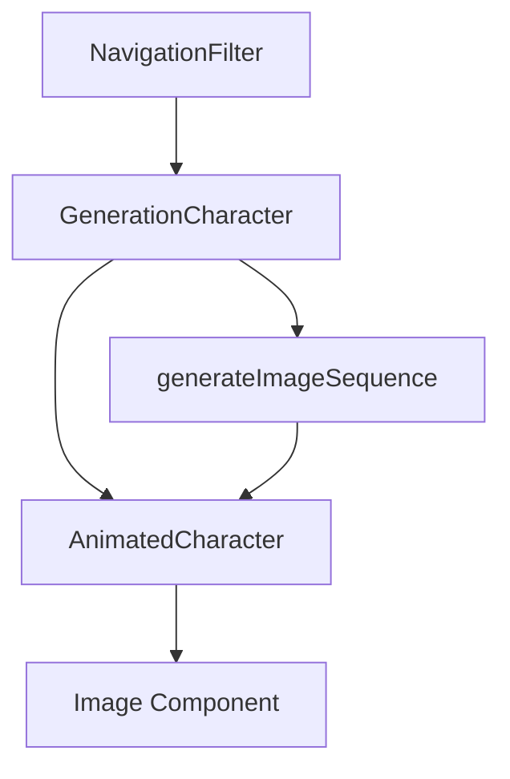

This is a [Next.js](https://nextjs.org) project bootstrapped with [`create-next-app`](https://nextjs.org/docs/app/api-reference/cli/create-next-app).

## Getting Started

First, run the development server:

```bash
npm run dev
# or
yarn dev
# or
pnpm dev
# or
bun dev
```

# 📘 Generational Handbook - Architecture Documentation

## 🎯 Overview

**Generational Handbook** is a Next.js application that helps users explore generational differences in the workplace through a guided 3-level navigation system: **Theme → SubTheme → Generation**.

---

## 🏗️ Application Architecture

### General Layout (Holy Grail Layout)

```
┌─────────────────────────────────────────────────────────────┐
│                        HEADER (Sticky)                       │
├──────────┬──────────────────────────────────────┬───────────┤
│          │                                  │               │
│  LEFT    │          MAIN CONTENT           │    RIGHT      │
│ SIDEBAR  │         (Scrollable)            │   SIDEBAR     │
│          │                                  │               │
│Navigation│  WelcomePage / Cards            │  Your Book    │
│ Filter   │                                  │               │
│          │                                  │               │
├──────────┴──────────────────────────────────┴───────────────┤
│                       FOOTER                                 │
└─────────────────────────────────────────────────────────────┘

Mobile: Vertical stack + Floating Action Button to open drawer
```

---

## 📂 File Structure and Responsibilities

### **Entry Point**

#### `src/app/page.tsx`
- **Role**: Application homepage
- **Content**: Renders `HandbookNavigator` + decorative image
- **Responsibility**: Visual entry point of the app

#### `src/app/layout.tsx`
- **Role**: Next.js root layout
- **Provider Stack**:
  ```typescript
  <ThemeProvider>          // Dark/light mode management
    <ImageCacheProvider>   // Global image cache (SV0002)
      <BookProvider>       // Personal "Your Book" management
        {children}
      </BookProvider>
    </ImageCacheProvider>
  </ThemeProvider>
  ```
- **Responsibility**: Global setup, fonts, metadata, providers

---

### **Core Navigation Logic**

#### `src/components/handbook/HandbookNavigator.tsx` 🧠
**THE BRAIN OF THE APP** - Manages all navigation state

**State Management:**
```typescript
- currentStep: 'theme' | 'subtheme' | 'generation'
- selectedTheme: Theme | null
- selectedSubTheme: SubTheme | null  
- selectedGeneration: Generation | null
- selectedCard: Card | null
```

**Navigation Flow:**
```
1. User selects Theme
   → setSelectedTheme()
   → currentStep = 'subtheme'
   
2. User selects SubTheme
   → setSelectedSubTheme()
   → currentStep = 'generation'
   
3. User selects Generation
   → setSelectedGeneration()
   → Automatically finds matching Card
   → selectedCard is populated
   → Stays on step 'generation'
```

**Rendered Components:**
- **Left Sidebar**: `NavigationFilter` (desktop) / `MobileNavigationDrawer` (mobile)
- **Main Content**: `MainContent`
- **Right Sidebar**: `YourBook` (desktop) / `YourBookModal` (mobile)

---

### **UI Components**

#### `src/components/handbook/NavigationFilter.tsx`
**Left sidebar navigation**

**Responsibilities:**
- Shows current step (theme/subtheme/generation)
- Renders selectable options based on step
- Handles animations with Framer Motion
- **Special feature**: When step='generation', displays 4 animated `GenerationCharacter` components

**Props received from HandbookNavigator:**
- `currentStep`, `selectedTheme`, `selectedSubTheme`, `selectedGeneration`
- Callbacks: `onThemeSelect`, `onSubThemeSelect`, `onGenerationSelect`, `onBack`

---

#### `src/components/handbook/MainContent.tsx`
**Central area - displays content based on state**

**Rendering Logic:**

```typescript
if (!selectedTheme) 
  → <WelcomeContent />

if (selectedTheme && !selectedSubTheme)
  → Show Theme introduction

if (selectedSubTheme && !selectedGeneration)
  → Show SubTheme description + prompt to select Generation

if (selectedCard)
  → Show complete Card with:
     - Stereotype (🏷️ red box)
     - Research Findings (📊 green box)
     - Strategies & Advice (💡 blue box)
     - "Add to Handbook" button
```

**Integration with BookProvider:**
- `addPage()` to save pages to personal book
- `toast.success()` for visual feedback

---

#### `src/components/handbook/YourBook.tsx`
**Right sidebar - personal book management**

**Responsibilities:**
- Shows user-saved pages
- Allows page removal
- Connected to `BookProvider` for persistent state (localStorage)

---

### **Layout Components**

#### `src/components/layout/Header.tsx`
**Sticky header with:**
- Logo (link to `/`)
- Navigation menu: MyCo Website, MyLastHandBook, How To
- Language selector (EN, DE, IT, PL, PT)
- Theme toggle (dark/light)
- YourBookBadge (mobile)
- Mobile hamburger menu

**⚠️ Note on Logo:**
Clicking the logo goes to `/` but **does NOT reset** navigation state. To fully reset, implement a `resetNavigation()` function (see discussed issue).

---

### **Animation Components** 🎬

#### `src/components/AnimatedCharacter/AnimatedCharacter.tsx`
**Component for displaying animated image sequences**

**Features:**
- Intelligent preloading with skeleton loader
- Hover animation
- Loop support
- Error handling
- **SV0001 + SV0002 Optimizations**:
  - Image array memoization
  - Global cache to prevent reloading

**Hook used:**
- `useImagePreloader.ts`: handles preload + global cache integration

---

#### `src/components/GenerationCharacter/GenerationCharacter.tsx`
**Specialized wrapper for generation characters**

**Responsibilities:**
- Wrapper around `AnimatedCharacter`
- Generation-specific configuration
- Styling (colored borders, dimensions)
- **SV0001 Optimization**: Uses `useMemo` for image arrays

**Data from `handbook-data.ts`:**
```typescript
characterFolder: 'genZ',
frameStart: 86400,
frameEnd: 86515,
framePrefix: 'genZ_'
```

---

### **Providers** 🔌

#### `src/components/providers/theme-provider.tsx`
- **Manages**: Dark/Light mode
- **Storage**: localStorage with key `theme`
- **Hook**: `useTheme()` → `{ theme, toggleTheme }`

#### `src/components/providers/book-provider.tsx`
- **Manages**: User's personal book
- **Storage**: localStorage with key `handbook-book`
- **Structure**: Array of `BookPage[]`
- **Hook**: `useBook()` → `{ pages, addPage, removePage, clearBook }`

#### `src/components/providers/image-cache-provider.tsx` 🆕 **SV0002**
- **Manages**: Global cache of preloaded images
- **Structure**: `Set<string>` of image URLs
- **Persistence**: Memory only (resets on page refresh - desired behavior)
- **Hook**: `useImageCache()` → `{ isImageCached, areAllImagesCached, addImagesToCache, clearCache, cacheSize }`
- **Performance**: O(1) lookup, prevents repeated preloading

---

### **Data Layer**

#### `src/data/handbook-data.ts`
**Single source of truth for all app data**

**Structures:**
```typescript
Theme {
  id, title, introduction, subThemes[], reportPdfUrl?
}

SubTheme {
  id, title, page_id
}

Generation {
  id, title, ageRange, characterFolder, frameStart, frameEnd, framePrefix
}

Card {
  id, title, themeId, subThemeId, generationId,
  stereotype, researchFindings, strategiesAdvice
}
```

**Naming Conventions:**
- Theme: `'work'`, `'communication'`
- SubTheme: `'work-values'`, `'work-motivation'`
- Card: `'work-values-genz'`
- Generation: `'genz'`, `'millennial'`, `'genx'`, `'boomer'`

**Helper functions:**
- `getCardsByTheme(themeId)`
- `findCard(generationId, subThemeId)`
- `getThemeById(themeId)`

---

## 🔄 Complete User Flow

```
1. WELCOME PAGE
   User arrives at /
   └─ <WelcomeContent /> shown in MainContent
   └─ NavigationFilter shows list of Themes

2. THEME SELECTION
   User clicks "Differences in approach to work"
   └─ HandbookNavigator: setSelectedTheme('work'), setCurrentStep('subtheme')
   └─ NavigationFilter: shows list of SubThemes for work theme
   └─ MainContent: shows theme introduction + PDF report

3. SUBTHEME SELECTION
   User clicks "Workplace Values Across Generations"
   └─ HandbookNavigator: setSelectedSubTheme('work-values'), setCurrentStep('generation')
   └─ NavigationFilter: shows 4 animated GenerationCharacter components
   └─ MainContent: shows prompt "Select a generation..."

4. GENERATION SELECTION
   User clicks Gen Z avatar
   └─ HandbookNavigator: setSelectedGeneration('genz')
   └─ Automatically finds card: findCard('genz', 'work-values')
   └─ setSelectedCard(foundCard)
   └─ MainContent: Renders complete Card with:
       - Stereotype (🏷️)
       - Research Findings (📊)
       - Strategies & Advice (💡)
       - "Add to Handbook" button

5. SAVING TO BOOK
   User clicks "Add to Handbook"
   └─ BookProvider: addPage({ id, title, themeId, subThemeId, generationId, cardId })
   └─ LocalStorage updated
   └─ YourBook sidebar updated
   └─ Toast: "Added to your handbook!"

6. BACK NAVIGATION
   User clicks "Back" in NavigationFilter
   └─ HandbookNavigator: handleBack()
   └─ Resets previous step
   └─ UI updates accordingly
```

---

## ⚡ Performance Optimizations (SV0001 + SV0002)

### **SV0001 - Image Array Memoization**
**File**: `GenerationCharacter.tsx`

```typescript
const images = useMemo(() => {
  return generateImageSequence({
    basePath: `/characters/${characterFolder}`,
    prefix: framePrefix,
    startFrame, frameEnd,
    digits: framePrefix ? 3 : 0,
    extension: 'png'
  })
}, [characterFolder, framePrefix, frameStart, frameEnd])
```

**Benefit**: Array not regenerated on every render

---

### **SV0002 - Global Image Cache**

**Modified Components:**
1. `image-cache-provider.tsx` (new)
2. `useImagePreloader.ts` (cache integration)
3. `AnimatedCharacter.tsx` (intelligent initialization)

**Flow:**
```
First visit:
  areAllImagesCached(images) → false
  → Normal preload + add to cache
  → Show skeleton + animations

Second visit (same character):
  areAllImagesCached(images) → true
  → Skip preload completely
  → isLoading starts as false
  → Animations appear INSTANTLY
```

**Performance:**
- First visit: Normal loading (~2-3s)
- Subsequent visits: **Instant** (0ms)
- Cache limited to session (resets on page refresh)

---

## 🎨 Animations and UX

**Library**: Framer Motion

**Configurations**: `src/data/config/animations.ts`
- `fadeSlideUp`: Fade in + slide from bottom
- `staggerContainer` + `staggerItem`: Cascading animations
- `scalePop`: Scale effect for buttons
- `pageTransition`: Transitions between steps

**Used in:**
- NavigationFilter (step changes)
- MainContent (card rendering)
- GenerationCharacter (hover effects)

---

## 📱 Responsive Design

**Desktop (≥1024px):**
- 3-column layout (NavigationFilter | MainContent | YourBook)
- Hover interactions enabled
- Back button in NavigationFilter

**Mobile (<1024px):**
- Vertical stack
- Floating Action Button (bottom-right) to open `MobileNavigationDrawer`
- YourBook accessible via badge in Header → opens `YourBookModal`
- Generations in 2x2 grid instead of vertical list

---

## 🔑 Key Points for Future Development

### ✅ Already Implemented:
- Global image cache (SV0002)
- Array memoization (SV0001)
- 3-level navigation
- Personal book with localStorage
- Dark mode
- Mobile/desktop responsive

### 🚧 To Be Implemented:
- **SV0006**: Global preload with progress bar when user reaches "generation" step
- **Navigation reset** on logo click (requires `resetNavigation()` function in HandbookNavigator)
- Internationalization (language selector in UI but not functional)
- Complete data population for all themes (currently only "work" has complete cards)

---

## 🐛 Technical Notes

**LocalStorage Keys:**
- `theme`: dark/light mode
- `handbook-book`: saved pages

**Image Paths:**
- Characters: `/public/characters/{characterFolder}/{framePrefix}_{frameNumber}.png`
- Cards: `/public/images/cards/{number}.png`

**Important:**
- Don't use `localStorage` in artifacts (not supported in Claude.ai environment)
- Always use React state for in-memory data in artifacts

---

## 📚 Reference Documents

- **AnimatedCharacter**: See existing README for technical details on image sequences
- **Data Structure**: `handbook-data.ts` for naming conventions and data structure
- **Color System**: `src/data/config/colors.ts` for Tailwind classes for generations

---

## 🛠️ Development Task IDs

### Completed:
- **SV0001**: Image array memoization in GenerationCharacter
- **SV0002**: Global image cache system

### Planned:
- **SV0003**: Optimized skeleton loader
- **SV0005**: CSS opacity fix
- **SV0006**: Global preload with progress bar
- **SV0007**: Intelligent preload (optional)

---

**This document provides a complete overview of the application architecture to facilitate onboarding of new developers and future maintenance.**


# Animated Characters System

## Overview
The Animated Characters system provides smooth, performant sprite-based animations for character representations throughout the application. It uses a sequence of PNG images to create flipbook-style animations triggered by user interaction.

## Architecture

### Components Structure
```
src/
├── components/
│   ├── AnimatedCharacter/           # Core animation engine
│   │   ├── AnimatedCharacter.tsx    # Main component
│   │   ├── AnimatedCharacter.types.ts
│   │   ├── AnimatedCharacter.module.css
│   │   └── hooks/
│   │       └── useImagePreloader.ts # Image preloading logic
│   └── GenerationCharacter/         # Generation-specific wrapper
│       └── GenerationCharacter.tsx  # Wrapper for generation avatars
└── utils/
    └── imageSequence.ts             # Image sequence generator utility
```

### Image Assets Structure
```
public/
└── characters/
    ├── test/          # Test animations
    │   ├── 86400.png
    │   ├── 86401.png
    │   └── ...
    ├── silent/        # Silent Generation
    │   ├── frame_001.png
    │   ├── frame_002.png
    │   └── ...
    ├── boomer/        # Baby Boomers
    │   └── frame_XXX.png
    ├── genx/          # Generation X
    │   └── frame_XXX.png
    ├── millennial/    # Millennials
    │   └── frame_XXX.png
    ├── genz/          # Generation Z
    │   └── frame_XXX.png
    └── alpha/         # Generation Alpha
        └── frame_XXX.png
```

## Component Hierarchy



## Usage Guide

### 1. Basic AnimatedCharacter Usage

The core `AnimatedCharacter` component requires an array of image paths:

```typescript
import { AnimatedCharacter } from '@/components/AnimatedCharacter';

// Direct usage with image array
<AnimatedCharacter
  images={[
    '/characters/test/001.png',
    '/characters/test/002.png',
    '/characters/test/003.png'
  ]}
  alt="Test Animation"
  width={200}
  height={200}
  frameRate={24}
  loop={true}
  playOnHover={true}
/>
```

### 2. Using the Image Sequence Generator

For numbered sequences, use the `generateImageSequence` utility:

```typescript
import { generateImageSequence } from '@/utils/imageSequence';

const images = generateImageSequence({
  basePath: '/characters/test',
  prefix: 'frame_',      // e.g., "frame_001.png"
  startFrame: 1,
  endFrame: 30,
  digits: 3,             // Padding: 001, 002, 003
  extension: 'png'
});

<AnimatedCharacter images={images} ... />
```

### 3. Generation Character Wrapper

For generation-specific avatars, use the simplified wrapper:

```typescript
import { GenerationCharacter } from '@/components/GenerationCharacter';

<GenerationCharacter
  characterFolder="genz"
  frameStart={1}
  frameEnd={30}
  framePrefix="frame_"
  size={80}
  frameRate={12}
  showBorder={true}
  borderColor="border-orange-500"
/>
```

### 4. Circular Avatar Style

To create circular avatars with borders:

```typescript
// Using GenerationCharacter (includes circular styling)
<GenerationCharacter
  characterFolder="millennial"
  frameStart={1}
  frameEnd={20}
  size={100}
  showBorder={true}
  borderColor="border-blue-500"
/>

// Or with AnimatedCharacter directly
<div className="w-24 h-24 rounded-full overflow-hidden border-2 border-orange-500">
  <AnimatedCharacter
    images={images}
    width={96}
    height={96}
    frameRate={24}
    loop={true}
    playOnHover={true}
  />
</div>
```

## Configuration Options

### AnimatedCharacter Props

| Prop | Type | Default | Description |
|------|------|---------|-------------|
| `images` | `string[]` | required | Array of image paths |
| `alt` | `string` | required | Alt text for accessibility |
| `width` | `number \| string` | `100` | Component width |
| `height` | `number \| string` | `100` | Component height |
| `frameRate` | `number` | `24` | Frames per second |
| `loop` | `boolean` | `true` | Loop animation |
| `playOnHover` | `boolean` | `true` | Play on hover (false = click to play) |
| `reverseOnLeave` | `boolean` | `true` | Return to frame 0 on mouse leave |
| `className` | `string` | `''` | Additional CSS classes |
| `showSkeleton` | `boolean` | `true` | Show loading skeleton |

### GenerationCharacter Props

| Prop | Type | Default | Description |
|------|------|---------|-------------|
| `characterFolder` | `string` | required | Folder name in `/public/characters/` |
| `frameStart` | `number` | required | First frame number |
| `frameEnd` | `number` | required | Last frame number |
| `framePrefix` | `string` | `''` | Filename prefix before number |
| `size` | `number` | `80` | Width and height (circular) |
| `frameRate` | `number` | `12` | Animation speed |
| `showBorder` | `boolean` | `true` | Show circular border |
| `borderColor` | `string` | `'border-slate-300'` | Tailwind border color class |

## File Naming Conventions

### Pattern 1: Simple Numbering
```
1.png, 2.png, 3.png, ... 120.png
```
Configuration:
```typescript
{
  prefix: '',
  digits: 0,  // No padding
}
```

### Pattern 2: Padded Numbers
```
001.png, 002.png, 003.png, ... 120.png
```
Configuration:
```typescript
{
  prefix: '',
  digits: 3,  // 3-digit padding
}
```

### Pattern 3: Prefix + Padded
```
frame_001.png, frame_002.png, ... frame_120.png
```
Configuration:
```typescript
{
  prefix: 'frame_',
  digits: 3,
}
```

### Pattern 4: Complex Naming
```
character_walk_00001.png, character_walk_00002.png
```
Configuration:
```typescript
{
  prefix: 'character_walk_',
  digits: 5,
}
```

## Performance Considerations

### Image Optimization
- Keep frame dimensions consistent across the sequence
- Use PNG for transparency, JPG for better compression (no transparency)
- Recommended max dimensions: 500x500px per frame
- Optimize images before adding (tools: TinyPNG, ImageOptim)

### Frame Count Guidelines
- **Icon/Avatar**: 10-20 frames
- **Button Animation**: 5-15 frames
- **Hero Animation**: 30-60 frames
- **Background**: 60-120 frames

### Preloading Strategy
The component automatically preloads all frames before displaying:
1. Shows skeleton loader during preload
2. Displays progress bar
3. Only starts animation when all frames are ready
4. Falls back gracefully on load errors

## Adding New Character Animations

1. **Prepare your image sequence:**
   - Export frames from your animation software
   - Name them consistently (e.g., `frame_001.png`, `frame_002.png`)
   - Place in `/public/characters/[character-name]/`

2. **Update generation data:**
```typescript
// In src/data/handbook-data.ts
{
  id: 'gen-new',
  title: 'New Generation',
  characterFolder: 'new-character',  // Your folder name
  frameStart: 1,
  frameEnd: 30,
  framePrefix: 'frame_',  // Your prefix
  // ...
}
```

3. **Use in component:**
```typescript
<GenerationCharacter
  characterFolder="new-character"
  frameStart={1}
  frameEnd={30}
  framePrefix="frame_"
  size={100}
/>
```
4. Traduzioni
{
  "work-values": {
    "genz": {
      "id": "work-values-genz",
      "title": "Gen Z: Workplace Values",
      "description": "Priority on flexibility, company purpose, social impact and mental wellbeing",
      "stereotype": "Gen Z is often depicted as restless, fixated on technology...",
      "researchFindings": "Studies show that Gen Z values openness, adaptability...",
      "strategiesAdvice": "In a marketing agency, Gen Z staff received support..."
    },
    "millennial": {
      "id": "work-values-millennial",
      "title": "Millennial: Workplace Values",
      "description": "Focus on personal growth, career opportunities and meaningful work",
      "stereotype": "Many people characterize Millennials as entitled...",
      "researchFindings": "Research indicates that Millennials prioritize...",
      "strategiesAdvice": "Millennials excel in environments that offer..."
    },
    "genx": {
      "id": "work-values-genx",
      "title": "Gen X: Workplace Values",
      "description": "Valuing autonomy, efficiency and work-life balance",
      "stereotype": "Generation X is often viewed as disillusioned...",
      "researchFindings": "Studies indicate that Generation X prioritizes...",
      "strategiesAdvice": "Organizations can assist Gen X by offering..."
    },
    "boomer": {
      "id": "work-values-boomer",
      "title": "Boomer: Workplace Values",
      "description": "Focus on company loyalty, traditional work ethic and hierarchy",
      "stereotype": "Baby Boomers are frequently depicted as excessively...",
      "researchFindings": "Studies indicate that Baby Boomers prioritize...",
      "strategiesAdvice": "To maintain the interest of Boomers, organizations..."
    }
  },
  
  "work-motivation": {
    "genz": {
      "id": "work-motivation-genz",
      "title": "Gen Z: Instant Feedback & Learning",
      "description": "Motivated by immediate recognition and continuous learning opportunities",
      "stereotype": "...",
      "researchFindings": "...",
      "strategiesAdvice": "..."
    },
    "millennial": { ... },
    "genx": { ... },
    "boomer": { ... }
  },
  
  "work-styles": {
    "genz": { ... },
    "millennial": { ... },
    "genx": { ... },
    "boomer": { ... }
  }
}
```

---

### Perché Questa Struttura?

#### **cards/work.json Contiene:**
```
SubTheme: work-values
  ├─ Card GenZ
  ├─ Card Millennial
  ├─ Card GenX
  └─ Card Boomer

SubTheme: work-motivation
  ├─ Card GenZ
  ├─ Card Millennial
  ├─ Card GenX
  └─ Card Boomer

SubTheme: work-styles
  ├─ Card GenZ
  ├─ Card Millennial
  ├─ Card GenX
  └─ Card Boomer
```

**Totale:** 3 SubThemes × 4 Generations = **12 cards in `work.json`**

---

### Relazione SubTheme ↔ Cards

#### **SubTheme (Markdown)**
```
File: subthemes/work-values.md
Contiene: Introduzione generale sul tema "Workplace Values"
          Spiega differenze generazionali ad alto livello
          Immagini, grafici, contesto
```

#### **Cards (JSON)**
```
File: cards/work.json → work-values → genz/millennial/genx/boomer
Contiene: Dettaglio specifico PER GENERAZIONE
          - Stereotype
          - Research Findings  
          - Strategies & Advice
```

---

### Flow Utente Completo
```
1. User seleziona Theme: "Work"
   └─ Vede: themes.json → work.introduction

2. User seleziona SubTheme: "Workplace Values"
   └─ Vede: subthemes/work-values.md (contenuto lungo)
   └─ Vede: Prompt "Select a generation to see specific approaches"

3. User seleziona Generation: "Gen Z"
   └─ Vede: cards/work.json → work-values → genz
           (Stereotype, Research, Strategies)
```

---

### Esempio Visivo Relazione
```
Theme: Work
├─ SubTheme: Workplace Values
│  ├─ Content: work-values.md (Markdown - intro generale)
│  └─ Cards:
│     ├─ GenZ Card     (work.json → work-values.genz)
│     ├─ Millennial Card (work.json → work-values.millennial)
│     ├─ GenX Card     (work.json → work-values.genx)
│     └─ Boomer Card   (work.json → work-values.boomer)
│
├─ SubTheme: Motivation
│  ├─ Content: work-motivation.md
│  └─ Cards:
│     ├─ GenZ Card     (work.json → work-motivation.genz)
│     └─ ...
│
└─ SubTheme: Work Styles
   ├─ Content: work-styles.md
   └─ Cards:
      ├─ GenZ Card     (work.json → work-styles.genz)
      └─ ...